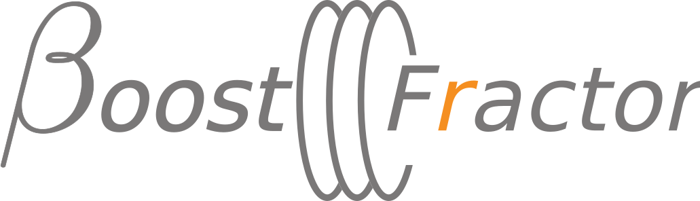

#  <!--BoostFractor.jl-->

MadMax electrodynamics simulation in Julia.

## General Remarks
<!--For the ease of use and to make an easy overview possible, the things here are only a minimal subset of all the code I have written, i.e., I have left out all the code which is actually initializing my specific simulations, running, saving and evaluating them, including making nice plots. I might include some more examples at a later point when everything is more mature.-->

Note that also a [**1D code**](docs/src/1d_model.md) including some basic optimization
examples is available.

## Prequisits

To install packages just run
```julia
julia> using Pkg
julia> pkg"add https://github.com/mppmu/BoostFractor.jl.git"
```
If this does not work replace the URL by whatever is shown when you click the green "Clone or Download" button on the top right.

<!--- julia> pkg"add git@github.com:mppmu/BoostFractor.jl.git" -->

You might find it useful to also add other Julia packages, e.g.

```julia
julia> using Pkg
julia> pkg"add Plots PyPlot IJulia JLD"
```

## Usage
The following are minimal working examples

### Loading of the package in your code
After the installation above just run
```julia
using BoostFractor
```

or if you want to use it one many processes / threds the same time
```julia
using Distributed
@everywhere begin # This executes the following on all your processes.
    using BoostFractor
end
```


### Single Dielectric Disk infront of a Mirror
```julia
# First we need to initialize a SetupBoundaries object
# containing information how the setup that we want
# to study looks like
# @everywhere creates one for each process

@everywhere sbdry = SeedSetupBoundaries(1)

# We need to define the permittivity of all areas and the reflection
# coefficient of the boundaries
# The system is always defined from left to right
# and reflection coefficients are defined for the right-propagating wave.

# Permittivity
epsilon = 9
sbdry.eps = Array{Complex{Float64}}([1,epsilon,1])

# Refelectivity (might be automatized at a later point, because double information...)
R = -(1 - sqrt(epsilon)) / (1 + sqrt(epsilon))
sbdry.r = Array{Complex{Float64}}([1.0, -R, R, 0]);
# The order is: Ref. Coeff as seen from [inside the mirror to vacuum, vacuum to disk, disk to vacuum, vacuum to receiver (should be 0)]

# We can also set relative tilts, etc.
sbdry.relative_tilt_x = zeros(3);
sbdry.relative_tilt_y = zeros(3);

# Let us sweep over different disk phase depths for a disk at distance lambda/2 infront of the mirror
# Of course the same way you can create a parallelized frequency sweep, etc.
@everywhere Deps = 0:0.05:3*pi
@everywhere zcat(args...) = cat(dims = 3, args...)
result = @sync @distributed (zcat) for i in 1:length(Deps)
    deps = Deps[i]
    dnu = pi # In my codes this gets optimized for maximal boost in 1D before; its left out here for simplicitly and just set to pi
    print("Running dEps = $deps (dNu = $dnu)... \n")

    # Set the distances (the wavelength in free space is 30mm, in the medium 10mm (free space devided by sqrt(epsilon))
    sbdry.distance = [(dnu)*3e-2/(2*pi), Deps[i]*1e-2/(2*pi),0];


    # We use the "dancer" algorithm to calculate our result

    #1D (if you calculate in 1D, use (vcat) above instead of (zcat) )
    #dancer(0,200,sbdry; prop=propagator1D,f=10e9,Xset=[0.0000001],Yset=[0.0000001])
    #3D    
    dancer(0,200,sbdry; prop=propagator,f=10e9,Xset=-0.5:0.01:0.5,Yset=-0.5:0.01:0.5)
end
```
Signature of dancer()-function:
```julia
"""
Propagates the fields through the system
	amin:	Mimum (local) amplitude of a field, in order to be propagated
	nmax:	Maximum number of beam iteration steps, directly equivalent to how many boundaries a beam 'sees' at most
	bdry:	SetupBoundaries-Objekt, containing all relevant geometrical information (disk positions, epsilon, etc)
	f:		Frequency
	prop:	Propagator Function to use. Standard is propagator()
	reflect:	If nothing (standar value), the axion-induced signal is computed
				If set, this field defines a beam, for which the reflected beam will be calculated
	Xset, Yset:	Explicitly set the coordinate system for the fields
	returnsum:	If false, the out-propagating contributions after each iteration will be returned, without summing.
	immediatesum:	If false, the out-propagating contributions will be saved and summed up at the end.
"""
function dancer(amin, nmax, bdry::SetupBoundaries; f=10.0e9, prop=propagator, emit=nothing, reflect=nothing, Xset=X, Yset=Y, diskR=0.1, returnsum=true, immediatesum=true)
  ...
end
```

Until now I always used a = 0, but a different one might be also useful, but increase the runtime a bitalthough I did not study this due to time. For one disk + mirror I recommend ``nmax = 200``.
Empirically for more disks: for 5 Sapphire disks ``nmax=1600`` seems still good enough. For higher number it should roughly scale quadratically with the number of disks, so ``nmax=25600`` is good for 20 disks.
The X and Y grid should be set in such a way that the resolutition is at least half a wavelength, i.e. for this example it should be sufficient to just use ``Xset=-0.5:0.01:0.5,Yset=-0.5:0.01:0.5``, since the wavelength at 10GHz is roughly 3cm.

The ``results`` array should contain now an 3d array, the last axis corresponds to the different phase depths, the first two to the X and Y axis.

Note that one can iterate over frequency instead of disk phase depth in almost exactly the same way as described in the above example, by just replacing ``for i in 1:length(Deps)`` with ``for f in frequencies``, defining ``frequencies`` according to your needs, and setting ``..., f=f, ...`` when calling ``dancer()``.

## For Development
### Useful Links and literature

1D Model: https://arxiv.org/abs/1612.07057

Transfer Matrices in 3D: http://emlab.utep.edu/ee5390cem.htm
